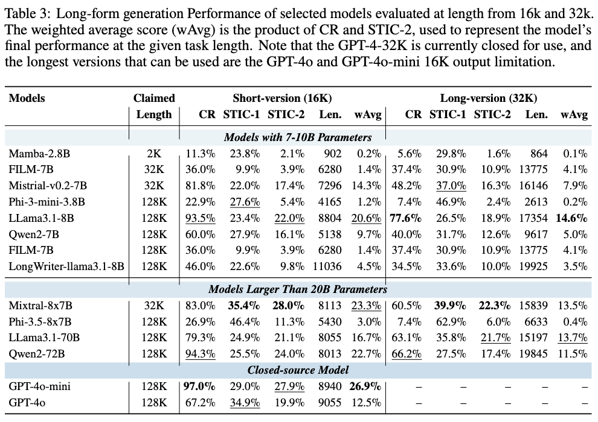

# LongGenBench: Benchmarking Long-Form Generation in Language Models

<p align="center">
  
</p>


<!--  -->
This repository provides the code and data for the paper **"LongGenBench: Benchmarking Long-Form Generation in Language Models"**(https://arxiv.org/abs/2408.07055).


<p align="center">
    🤗 <a href="https://huggingface.co/datasets/mozhu/LongGenBench" target="_blank">HF Repo</a> • 📃 <a href="https://arxiv.org/abs/2409.02076" target="_blank">Paper</a> 
</p>


# Language/语言: [English](./README.md) | [中文](./readme_zh.md)


## 🔥 Updates
**[2025/01/23]** Our paper has been accepted to the main track of ICLR 2025! 


## Overview
The **LongGenBench** benchmark is designed to assess the long-form content generation abilities of language models (LMs) for tasks requiring coherent, long-context outputs. Traditional benchmarks often focus on short-context tasks or specific information retrieval, such as the Needle-in-a-Haystack (NIAH) tests. In contrast, LongGenBench is engineered to probe the abilities of LMs to generate extended text sequences that are coherent and contextually rich, while adhering to detailed prompt instructions involving various constraints.

## Benchmark Design 


The benchmark evaluates 10 long-context LMs over a series of four scenarios with multiple sub-scenarios, each varying by the type of prompt instructions—single instance, range, and periodicity. These scenarios simulate real-world tasks such as urban planning, diary entries, or menu planning, where the LM must incorporate specific events, details, or constraints into a long-form text sequence.

## Evaluation Focus
SGT particularly emphasizes the model's capability to follow complex instructions over long text generation tasks, challenging the models with prompt lengths set at 16K and 32K tokens. This setup tests the models' endurance in maintaining coherence and relevance over long stretches of text, a critical measure for applications in fields like automated content creation, academic summarization, and narrative generation.


## Run

### Clone this repository:

```bash
git clone git@github.com:mozhu621/LongGenBench.git
cd SGT
pip install -r requirements.txt
```

### Evalution :
```bash
cd ./Evalution
bash Run_short_all_small_model.sh
bash Run_short_all_large_model.sh
bash Run_long_all_small_model.sh
bash Run_long_all_large_model.sh
```

### Static:
```bash
cd ./Evalution/results
Run all cells in sequence --- static.ipynb
```


### Result:



<!--
### Acknowledge

Due to unforeseen circumstances, the title of my paper shares some similarities with the EMNLP 2024 Findings paper titled *LongGenBench*. However, the focus of our paper is different.

The paper explores model output length under long input conditions by concatenating GSM8K and MMLU data. 

For more details, you can read their paper here: [EMNLP 2024 Findings: LongGenBench: Long-context Generation Benchmark](https://aclanthology.org/2024.findings-emnlp.48/).  
-->

## Citation

If you find this work useful in your research, please cite our paper:

```bibtex
@misc{wu2024longgenbenchbenchmarkinglongformgeneration,
      title={LongGenBench: Benchmarking Long-Form Generation in Long Context LLMs}, 
      author={Yuhao Wu and Ming Shan Hee and Zhiqing Hu and Roy Ka-Wei Lee},
      year={2024},
      eprint={2409.02076},
      archivePrefix={arXiv},
      primaryClass={cs.CL},
      url={https://arxiv.org/abs/2409.02076}, 
}
